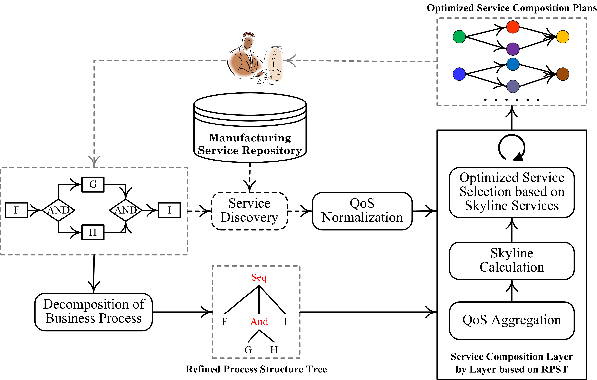

## Setup
All experiments are implemented on a PC with AMD Ryzen 5, CPU 2.38GHZ, and 16G RAM, running on Windows 10 x64 with Python 3.9.

## Dataset
- The data set we use is the first web service data set introduced in 2007 to measure the quality of service (QoS) of real web services. The main goal of this data set is to provide a foundation for web services researchers. Web services are collected using the Web Services Crawler Engine (WSCE). Most of these services are obtained from public sources on the web, including the Universal Description, Discovery and Integration (UDDI) registry, search engines, and service portals.[Click here to go directly to the official website of the dataset](https://qwsdata.github.io/)

## Characteristics of the database
|  Item   | Value  |
|  ----  | ----  |
| Number of the service  | 2507 |
| Number of the QoS properties  | 8 |
| The maxinmum of response time | 4989.67 |
| The minimun of response time | 37.00 |
| The maximun of availability | 1.00 |
| The minimun of availability | 0.07 |
| The maximun of throughput | 43.10 |
| The minimun of throughput | 0.10 |
| The maximun of reliability | 0.89 |
| The minimun of reliability | 0.33 |

## SQMSC: Scalable QoS-aware Manufacturing Service Composition optimization approach via business process decomposition
### 1. Motivation
With the development of service-oriented manufacturing model, more and more manufacturing services are released through manufacturing service platform. It is well known that the QoS-aware manufacturing service composition problem is NP-hard. Therefore, optimization remains a challenging research problem, especially in the case of large-scale manufacturing service data, which also raises scalability issues. In order to improve the optimization performance and scalability of QoS-aware manufacturing service composition, we think of a scalable QoS-aware manufacturing service composition optimization method based on business process decomposition to solve the problem step by step.[SQMSC code](https://github.com/IntelligentServiceLab/SQMSC/blob/main/SQMSC.py)
### 2. Baseline
| Baselines | Description | Code |
| :-----: | :---- | :----: |
| GA | This approach uses genetic algorithm. | [GA code](https://github.com/IntelligentServiceLab/SQMSC/blob/main/GA.py) |
| PSO | This approach uses particle swarm optimization algorithm. | [PSO code](https://github.com/IntelligentServiceLab/SQMSC/blob/main/PSO.py) |
| TLBO | This approach uses teaching learning based optimization algorithm. | [TLBO code](https://github.com/IntelligentServiceLab/SQMSC/blob/main/TLBO.py) |
| GA+Skyline | This approach uses genetic algorithm with initial Skyline services for each tasks. | [GA+Skyline code](https://github.com/IntelligentServiceLab/SQMSC/blob/main/GA%2BSkyline.py) |
| PSO+Skyline | This approach uses particle swarm optimization algorithm with initial Skyline services for each tasks. | [PSO+Skyline code](https://github.com/IntelligentServiceLab/SQMSC/blob/main/PSO%2BSkyline.py) |
| TLBO+Skyline | This approach uses teaching learning based optimization algorithm with initial Skyline services for each tasks. | [TLBO+Skyline code](https://github.com/IntelligentServiceLab/SQMSC/blob/main/TLBO%2BSkyline.py) |
| SQMSC-MH | This approach is a variant of SQWSC by not using a meta-heuristic algorithm, i.e., select the Skyline(compound) services. | [SQMSC-MH code](https://github.com/IntelligentServiceLab/SQMSC/blob/main/SQMSC-MH.py) |
### 3. Evalution
- Optimality with different number of QoS properties.

|  | 2 | 3 | 4 |
| :----: | :----: | :----: | :----: |
| SQMSC-MH | 97.83849075818293 | 91.84538563779238 | 90.64903784735586 |
| SQMSC | 87.4897763826431 | 82.32303283641438 | 80.26780550090027 |
| GA | 68.73259440154652 | 67.55399216342042 | 63.903419043016584 |
| GA+Skyline | 76.40572766805778 | 73.10892655823812 | 73.27862993013107 |
| PSO | 60.51195854721643 | 55.17907841495449 | 51.487213804391594 |
| PSO+Skyline | 69.58074795236917 | 66.57342985648108 | 63.90600935676791 |
| TLBO | 69.68441389201915 | 56.56176677600886 | 50.416221131933625 |
| TLBO+Skyline | 74.60445890990269 | 65.0304569811683 | 51.270468647746725 |
- Optimality with different number of service candidates.

|  | 20 | 40 | 60 | 80 | 100 |
| :----: | :----: | :----: | :----: | :----: | :----: |
| SQMSC-MH | 92.08604976141093 | 91.77855013291827 | 88.26681434623642 | 92.36521322453592 | 92.49011501887783 |
| SQMSC | 83.35698210764413 | 85.73108646577278 | 87.47518738903857 | 87.70558957658318 | 88.54390858880022 |
| GA | 57.77941551175034 | 58.68911538530792 | 59.35791571225612 | 61.86932107537522 | 70.62837061754836 |
| GA+Skyline | 58.589948092793485 | 58.86383445576805 | 63.42546691499192 | 64.99685453877844 | 71.44672425350066 |
| PSO | 47.42394129833906 | 49.33239802353247 | 49.05904980912834 | 50.027675930800804 | 48.00878879065049 |
| PSO+Skyline | 54.92737319576898 | 59.12248340671935 | 60.33556985087858 | 58.36956386616024 | 59.891694184114805 |
| TLBO | 49.74575913668209 | 54.671776338690144 | 54.317740187320275 | 52.98856990084743 | 55.03909809783939 |
| TLBO+Skyline | 53.74622587553793 | 62.44832310176658 | 67.31248795858882 | 71.63872478429907 | 70.80143030702146 |
- Scalability with different number of QoS properties.

|  | 2 | 3 | 4 |
| :----: | :----: | :----: | :----: |
| SQMSC-MH | 1.8742110000000016 | 44.29814710000001 | 67.10261820000001 |
| SQMSC | 6.438324199999998925 | 10.2966509999999971 | 12.1536984999999744 |
| GA | 31.35281999 | 42.167804751 | 49.87416223 |
| GA+Skyline | 16.5236609 | 22.7193692 | 27.1541851 |
| PSO | 55.3634121 | 63.73409817 | 66.30378693 |
| PSO+Skyline | 44.5543584 | 50.04044041 | 53.5290191 |
| TLBO | 36.6393984 | 44.03737040000001 | 52.7720596 |
| TLBO+Skyline | 31.0636968 | 26.7600426 | 30.4317083 |
- Scalability with different number of service candidates.

|  | 20 | 40 | 60 | 80 | 100 |
| :----: | :----: | :----: | :----: | :----: | :----: |
| SQMSC-MH | 0.6002301999999995 | 35.6901355 | 41.6336575 | 53.012968799999996 | 72.1134163 |
| SQMSC | 8.762266700000047781 | 11.95601510000000111 | 13.073432299999999 | 14.20586500000000015 | 15.065903499999997 |
| GA | 39.2843594 | 41.165903799999995 | 44.595518400000003 |46.384784100000005| 42.3830681 |
| GA+Skyline | 20.2148793 | 18.4587934 | 21.6777734 | 23.3792838 | 24.8068188 |
| PSO | 58.486479415 | 60.69495266 | 61.44815266 | 64.69434118 | 65.475394415 |
| PSO+Skyline | 44.8884597 | 49.74681186000008 | 52.047514549999995 | 55.13546811999988 | 56.438874295000005 |
| TLBO | 33.872206300000002 | 47.9586738 | 48.4562685 | 51.2441329 | 57.3288528 |
| TLBO+Skyline | 22.4986904 | 25.4216284 | 26.5533974 | 29.7677855 | 32.1032783 |

- Running time of each component in Alg. 1 with different number of QoS properties

|  | 2 | 3 | 4 |
| :----: | :----: | :----: | :----: |
| subtask | 0.009208799999999684 | 0.009847200000000278 | 0.011046299999999398 |
| compoundTask | 0.07878490000000049 | 1.3439001999999993 | 1.323939499999999 |
| GA | 9.188933799999999 | 12.777769 | 15.418582299999999 |
- Running time of each component in Alg. 1 with different number of service candidates

|  | 20 | 40 | 60 | 80 | 100 |
| :----: | :----: | :----: | :----: | :----: | :----: |
| subtask | 0.005989699999999765 | 0.009259899999999988 | 0.013277900000000287 | 0.017086400000000168 | 0.024998800000000543 |
| compoundTask | 0.3279809999999994 | 1.6510077 | 2.6586736000000002 | 5.3516318 | 5.759590899999999 |
| GA | 7.9854034 | 10.013262 | 11.3622174 | 13.4244668 | 15.0114512 |
### 4. SQMSC architecture

### 5. Supplemental instruction
- The input data of the above code are all data in the [qws2resetIndex](https://github.com/IntelligentServiceLab/SQMSC/blob/main/qws2resetIndex.csv) dataset. The qws2resetIndex dataset is roughly the same as the real dataset QWS2. The difference is that we have disturbed its row index.
- Qws2 reset Index records eight QoS attributes, including response time, availability, throughput, successability, reliability, compliance, best practices and latency.

## Parameters
### GA、GA+Skyline
- candidate_number: Number of services in candidate set of each subtask,
- crossover_probability
- mutation_probability
- task_number
- population_size
### PSO、PSO+Skylie：
- w: Inertia weight
- c1 and c2: Learning factor
- Vmax: speed limit
- task_number
- population_size
### TLBO、TLBO+Skyline
- task_number
- population_size
### SQWSC
- n: Number of QoS attributes
- candidate_number: Number of services in candidate set of each subtask
- crossover_probability
- mutation_probability
- task_number
- population_size

## Note：
- If you have any question about my code or want to share your idea, you can send email to me. Welcome at any time!
- Email: jiayanxiang02@gmail.com
